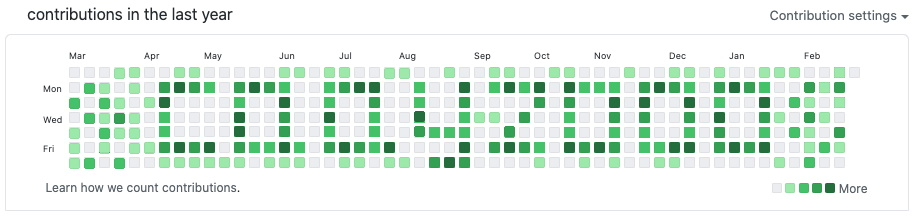

### Hi there 👋 I'm Albert Casanovas

I'm a software engineer from Barcelona, Catalonia, and this is my amazing **read.me**

<!--
🎉 Congratulations! You discovered the special section of this readme 🎉

- 🔭 I’m currently working at ... [ZOPA](https://zopa.com) ([Github](https://github.com/zopaUK))
- 🌱 I’m currently learning ... [LigGdx](https://libgdx.com/)
- 👯 I’m looking to collaborate on ... will think about it when I have some time 😅
- 🤔 I’m looking for help with ... A lot of things 🙏
- 💬 Ask me about ... Anything on my repo 😜
- 📫 How to reach me: ... Already explained 🤦‍️
- 😄 Pronouns: ... He/Him 👨
- ⚡ Fun fact: ... Whenever I try to lose weight, I end up getting fat 🏃
-->

